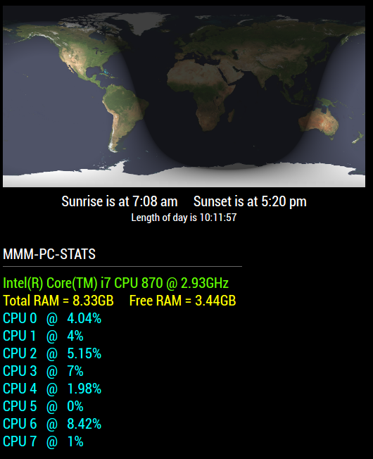
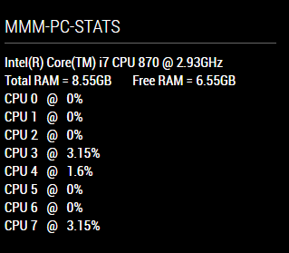
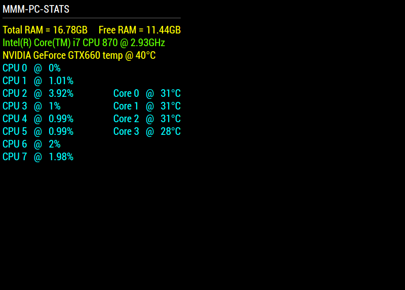
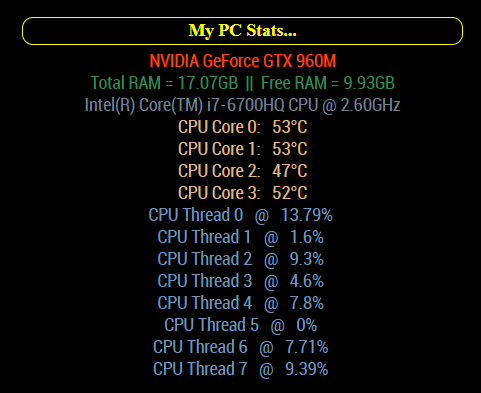
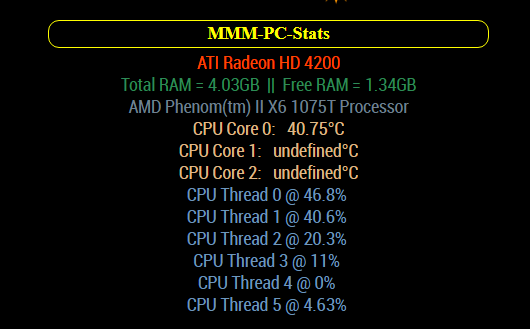

## MMM-PC-Stats

Designed for PC boards running MM. Retrieves the CPU name, amount of total RAM and Free Ram,
and identifies the CPU and the CPU load by percentage, per core/threads. Tested on ubuntu OS.
Now it gets the temperature of each core of your processor

## Initial version. Expect more options.

* You can set how often the data is retrieved (config option)

* You can set it so only the values change or the entire module fades in and out when data is retrieved.

* CPU temperature, per core.

* Annotated .css file included for coloring text and header.

##  **  Windows PC version requires the terminal you use to run MM to be run as ADMIN  **

## Examples

* One with color. One standard white.

 

* Windows PC version... (AMD CPU's will only have 1 CPU Core temp)

 

## Installation

* `git clone https://github.com/mykle1/MMM-PC-Stats` into the `~/MagicMirror/modules` directory.

* `npm install` in your `~/MagicMirror/modules/MMM-PC-Stats` directory.

## Config.js entry and options

    {
          disabled: false,
          module: 'MMM-PC-Stats',
          position: 'top_left',
	  config: {
	      GPU: "NVIDIA GeForce GTX660", // name of your video card
	      useHeader: true,           // true if you want a header. 
              header: "MMM-PC-Stats",    // Any text you want. useHeader must be true
              maxWidth: "300px",
              animationSpeed: 0,         // 0 = no fade in and out. Only CPU load and Free RAM usage changes.
	      updateInterval: 15 * 1000, // How often the CPU and Free RAM is checked for load and usage.
	  }
    },
	
## SpaceCowboysDude gets props for his loop magic trick and his combining 2 npm packages in one return
